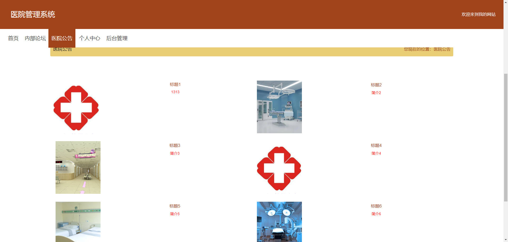

# 基于Springboot的医院管理系统

## Springboot-0051


## 技术栈

Springboot mybatisplus vue mysql maven


## 数据库表(14张)


## 功能介绍

```properties
本医院管理系统管理员功能，个人中心，医生管理，护士管理，病床类别管理，药品类别管理，科室信息管理，内部论坛管理，系统管理。医生功能，个人中心，病床管理，药房管理，病人信息管理，药方信息管理。护士功能修改个人中心，查看病床管理，查看药房管理，查看病人信息管理，查看药方信息管理。
```


## 图片

### 前台




### 后台


## 访问路径

### 前台

```properties
http://localhost:8080/springboot3v5bn/front/pages/login/login.html

账号 医生6
密码 123456
```

### 后台

```properties
http://localhost:8080/springboot3v5bn/admin/dist/index.html#/login

账号 abo
密码 abo
```


## 功能图


## 文档目录


## 打赏或交流


